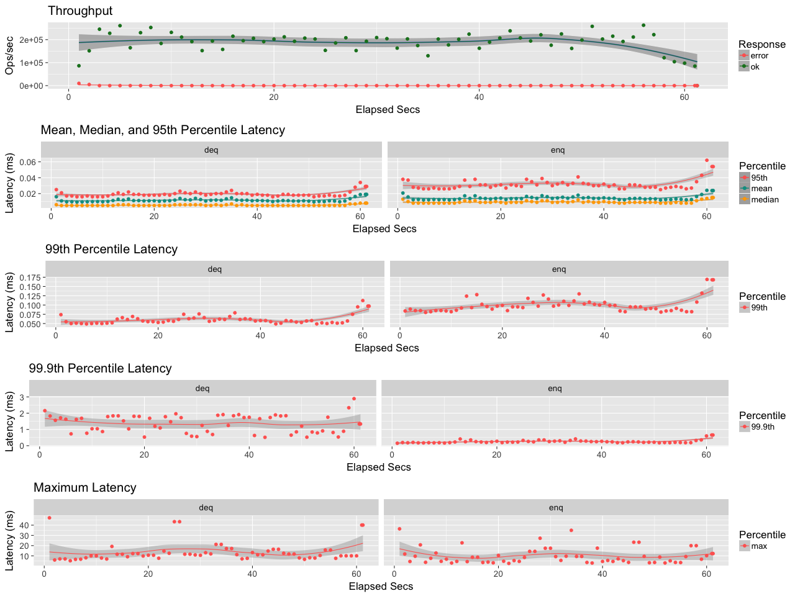

# Embeddable Simple Queue

The library implements persistent queue data structure for Erlang applications.

[](http://travis-ci.org/fogfish/esq) [](https://coveralls.io/github/fogfish/esq?branch=master)

## Inspiration

Queuing is an essential features required to implement scalable and fault tolerant applications. Any asynchronous communication is build around queues. There are various queuing systems on the market RabbitMQ, Kafka, AWS SQS, AWS Kinesis, etc. Each Erlang process has in-memory queue -- mailbox. Sometimes, persistence of messages is required for robustness and reliability. The library implements embeddable queue (data structure) with message persistence that enhances traditional mailbox features of Erlang processes.


## Getting started 

The latest version of the library is available at its master branch. All development, including new features and bug fixes, take place on the master branch using forking and pull requests as described in contribution guidelines.

### Installation

If you use rebar3 you can include the library in your project with

```erlang
{esq, ".*",
   {git, "https://github.com/fogfish/esq", {branch, master}}
}
```

### Usage

The library exposes public interface through exports of [esq.erl](src/esq.erl) module. Just call required function with required arguments, check out *Key features* for details.

Build library and run the development console

```bash
make
make run
```

## Key features

### Queue-compatible interface

The library implements mutable queue data structure due to file I/O. The data structure is a product of in-memory head and on-disk persistent tail. The head is kept in memory using [dequeue](https://github.com/fogfish/datum/blob/master/src/queue/deq.erl) data structure. It's capacity is limited to `C` messages. The [disk queue](src/esq_file.erl) is built as chain of files (64MB each segment). The queue rotates file segment when head is fully consumed by application.

Let's take a short tour to the queue interface

```erlang
%%
%% create an empty queue data structure
{ok, Q} = esq:new("/tmp/q").

%%
%% enqueue the message to queue, it returns a new copy of the queue.
ok = esq:enq(a, Q).

%%
%% enqueue multiple messages to queue
[esq:enq(X, Q) || X <- [b, c, d, e]].


%%
%% dequeue message(s) from queue, it returns a list of elements
%% each element is the map #{payload => payload()} that carries payload 
%% and other message properties
[#{payload := a}] = esq:deq(Q).

%%
%% dequeue multiple messages from queue
_ = esq:deq(4, Q).

```

### Message persistency

Queue persistency uses sequential disk I/O. It implements a queue as collection of file segments. Messages are appended to last file segments during enqueue operation and read from first segment.  

```
         head             tail                                
         +----------+     +---+   +---+       +---+            
deq <----+    C     <-----+ q |   | q |  ...  | q <-------+ enq
         +----------+     +---+   +---+       +---+            
                             ro      ro          wr

|-----( in-memory )-----|---------( on-disk )---------| 
```
Any point of time a segment is either open for write or read. Segments are rotated with a frequency defined by time-to-sync (`tts`) timer. Note this timer might cause and invisibility of overflow message if dequeue rate is higher then enqueue.  

Queue starts to "swap" to file segments only when enqueue rate causes an overflow of in-memory buffer. 


### In-flight capabilities

A message is in-flight after it's dequeue from a queue by a consumer, but not yet acknowledged. There is no guarantee in distributed system that the consumer receive and process message. Thus, the consumer must explicitly acknowledge message using its receipt identity. 

```
         head             tail                                
         +----------+     +---+   +---+       +---+            
deq <-+--+    C     <-----+ q |   | q |  ...  | q <-------+ enq
      |  +----------+     +---+   +---+       +---+            
      |   ^                  ro      ro          wr            
      |   |                                                    
      |  ++---------+                                          
ack +-+-->    C     |                                          
         +----------+                                          
         in-flight heap                                                  
```

Let's evaluate the in-flight feature.

```erlang
%%
%% create a queue and enable in-flight feature using time-to-flight (ttf)
{ok, Q} = esq:new("/tmp/q", [{capacity, 10}, {ttf, 5000}]).

%%
%% enqueue multiple messages to queue
[esq:enq(X, Q) || X <- [a, b, c, d, e, f, g, h]].

%%
%% dequeue message and read it's receipt
[#{receipt := Receipt}] = esq:deq(Q).

%%
%% acknowledge the message to queue
esq:ack(Receipt, Q).

%%
%% message becomes visible to consumer again if acknowledgement is not
%% delivered with-in time-to-flight
[#{payload := X}] = esq:deq(Q).

timer:sleep(6000).

[#{payload := X}] = esq:deq(Q).
```

### Queue timers

* `ttl` message time-to-live in milliseconds, expired messages are evicted from queue. The eviction process is executed during reads.
* `ttf` message time-to-flight in milliseconds, the time required to deliver message acknowledgment before it reappears to client(s) again. If parameter is not defined then in-flight heap is not used and message acknowledgment is not required.
* `tts` queue time-to-sync (rotate) file segments in milliseconds. Any enqueue message might remain invisible until sync is performed. 

### Performance

The queue performance is evaluated using [basho benchmark](https://github.com/basho/basho_bench) with [25% dequeue and 75% enqueue workload](priv/esq.benchmark) on MacBook Pro, Intel Core i7, 2.8GHz, 16GB 2133 MHz LPDDR3, 256 SSD




## How to Contribute

The daemon is Apache 2.0 licensed and accepts contributions via GitHub pull requests:

* Fork the repository on GitHub
* Read build instructions
* Make a pull request

The build process requires [Erlang/OTP](http://www.erlang.org/downloads) version 19.0 or later and essential build tools.

**Build** and **run** service in your development console. The following command boots Erlang virtual machine and opens Erlang shell.

```bash
git clone https://github.com/fogfish/esq
cd esq
make
make run
```

Now you are able to create queues and debug them.

### commit message

The commit message helps us to write a good release note, speed-up review process. The message should address two question what changed and why. The project follows the template defined by chapter [Contributing to a Project](http://git-scm.com/book/ch5-2.html) of Git book.

>
> Short (50 chars or less) summary of changes
>
> More detailed explanatory text, if necessary. Wrap it to about 72 characters or so. In some contexts, the first line is treated as the subject of an email and the rest of the text as the body. The blank line separating the summary from the body is critical (unless you omit the body entirely); tools like rebase can get confused if you run the two together.
> 
> Further paragraphs come after blank lines.
> 
> Bullet points are okay, too
> 
> Typically a hyphen or asterisk is used for the bullet, preceded by a single space, with blank lines in between, but conventions vary here
>
>

### bugs

If you experience any issues with the library, please let us know via [GitHub issues](https://github.com/fogfish/esq/issue). We appreciate detailed and accurate reports that help us to identity and replicate the issue. 

* **Specify** the configuration of your environment. Include which operating system you use and the versions of runtime environments. 

* **Attach** logs, screenshots and exceptions, in possible.

* **Reveal** the steps you took to reproduce the problem.


## Changelog

The library uses [semantic versions](http://semver.org) to identify stable releases. 

* 1.0.0 - a simplified persistent queue
* 0.8.5 - a stable release of queue that supports various back-ends


## License

Copyright 2013 Dmitry Kolesnikov

Licensed under the Apache License, Version 2.0 (the "License"); you may not use this file except in compliance with the License. You may obtain a copy of the License at http://www.apache.org/licenses/LICENSE-2.0.

Unless required by applicable law or agreed to in writing, software distributed under the License is distributed on an "AS IS" BASIS, WITHOUT WARRANTIES OR CONDITIONS OF ANY KIND, either express or implied. See the License for the specific language governing permissions and limitations under the License.
