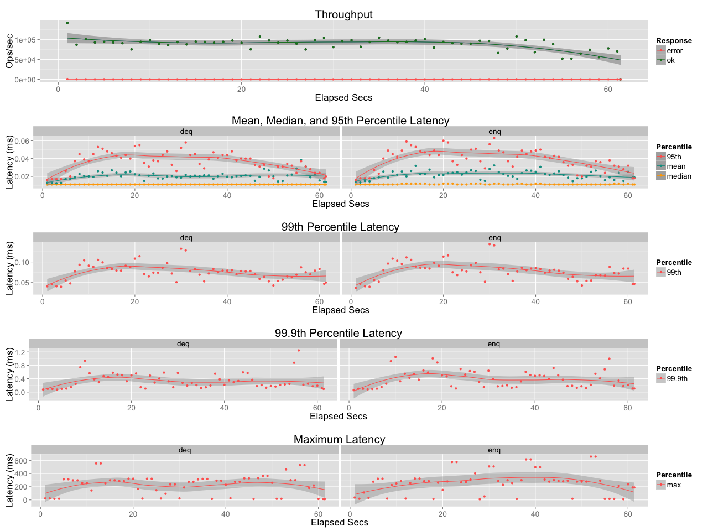

# Embeddable Simple Queue for Erlang

The library provides embeddable best-effort queue with persistence and in-flight capabilities.
The head is kept in memory using dequeue data structure. It is capacity is limited to C message.
The head overflow causes swap to disk. The disk queue is built as chain of files (64MB each segment).
The queue rotates file segment when head is fully consumed by application. The queue also maintain 
in-flight heap that temporary keeps dequeued messages. Clients shall acknowledge message otherwise messages are moved to head of queue again. 

The crash of VM might cause loss of data: queue head is in-memory data structure and file segment writer uses delayed write.

```
         head             tail                                
         +----------+     +---+   +---+       +---+            
deq <-+--+    C     <-----+ q |   | q |  ...  | q <-------+ enq
      |  +^---------+     +---+   +---+       +---+            
      |   |                  ro      ro          wr            
      |   |                                                    
      |  ++---------+                                          
ack +-+-->    C     |                                          
         +----------+                                          
         heap                                                  
```

## interface

### new/1

creates queue, it accepts list of options:

* ttl - message time-to-live in milliseconds, expired messages are evicted from head of queue.
* ttf - message time-to-flight in milliseconds, the time required to deliver message acknowledgment before it reappears to client(s) again. If parameter is not defined then in-flight heap is used and message acknowledgment is not required.
* tts - time-to-sync (rotate) file segments in milliseconds. Any swapped message might remain invisible until sync is performed. 
* fspool - path to file segments. The persistence feature is disabled if parameter is not defined.

### free/1

close all open file descriptors and releases queue memory

### enq/2

enqueue message to queue, returns new queue state.

### deq/2

dequeue messages from queue, return list of messages and new state.

## Usage


```erlang
   esq:start(). 
   
   Queue0 = esq:new([]).
   Queue1 = esq:enq(<<"my message">>, Queue0).
   {[{_, <<"my message">>}], Queue2} = esq:deq(Queue1).
   esq:free(Queue2).
```

## Performance

   MacBook Pro, Intel Core i5, 2.5GHz, 8GB 1600 MHz DDR3, 256 SSD

   See priv/esq.benchmark for details

### Heap queue

   

### Disk queue

   

 


